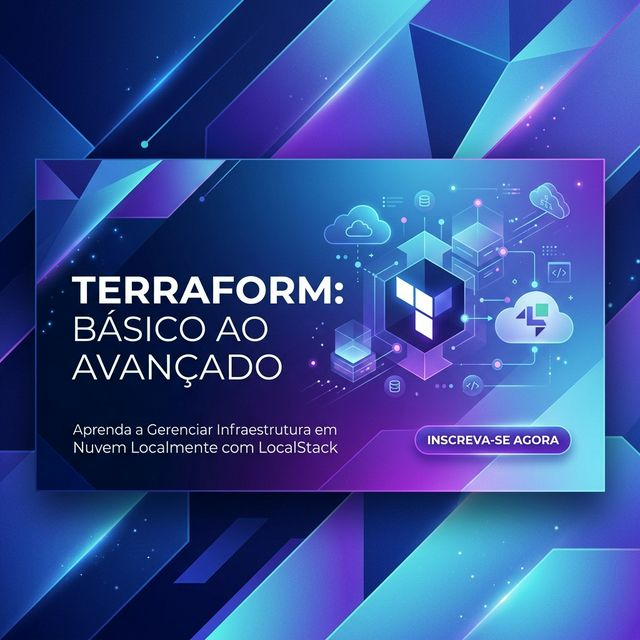

<div align="center">
  
  
  # 🌍 Terraform: Do Básico ao Avançado
  ### *LocalStack Edition*

  [](https://www.terraform.io/)
  [](https://localstack.cloud/)
  [](https://www.docker.com/)
  [](https://www.udemy.com/course/terraform-do-basico-ao-avancado/)
</div>

---

## 📖 Sobre o Repositório

Este repositório é dedicado ao acompanhamento do curso **Terraform do Básico ao Avançado** (https://www.udemy.com/course/terraform-do-basico-ao-avancado/) na Udemy. A grande diferença aqui é o foco em **custo zero** e **segurança total**, utilizando o **LocalStack** para simular toda a infraestrutura da AWS diretamente na sua máquina local.

### 🎯 Por que LocalStack?
- **💰 Economia:** Sem surpresas na fatura da AWS ao final do mês.
- **🛡️ Segurança:** Teste políticas de IAM e Buckets S3 sem riscos de exposição real.
- **⚡ Velocidade:** Iterações mais rápidas sem latência de rede para a nuvem.

---

## 🛠️ Configuração do Ambiente Local

O ambiente é gerenciado via **Docker Compose**, subindo os serviços necessários de forma automatizada.

### 1. Iniciar os Containers
```bash
docker-compose up -d
```

### 2. Endpoints Locais
O LocalStack emula a AWS em `http://localhost:4566`. O provider no Terraform já está pré-configurado:
```hcl
endpoints {
  s3  = "http://localhost:4566"
  sts = "http://localhost:4566"
  iam = "http://localhost:4566"
}
```

---

## 🕵️‍♂️ Governança e Boas Práticas (.gitignore)

Seguindo padrões de nível profissional (mesmo em nível básico), configuramos o `.gitignore` para proteger o ambiente e evitar redundância.

### O que está sendo ignorado?
- **`.terraform/`**: Binários e módulos baixados durante o `init`.
- **`*.tfstate`**: O arquivo de estado local (contém o mapeamento da sua infra).
- **`*.tfvars`**: Arquivos de variáveis que podem conter segredos (como senhas).

> [!WARNING]
> **Consequência:** Ao clonar o repositório, você **não** verá a infraestrutura "já criada". Você precisará inicializar e aplicar o plano localmente para que o Terraform entenda o estado atual do seu LocalStack.

---

## 🧪 Guia de Teste Local

Se você deseja testar este laboratório na sua máquina, siga estes passos:

1. **Navegue até o diretório do recurso** (ex: `aws-bucket`).
2. **Inicialize o projeto**: `terraform init` (Isso baixará os providers).
3. **Verifique o plano**: `terraform plan` (Veja o que será criado no LocalStack).
4. **Aplique as mudanças**: `terraform apply` (Confirme com `yes`).

---

## ⚠️ Observações sobre Azure

Este repositório não foca 100% na integração com Azure, pois o suporte do LocalStack para Azure (`localstack-azure-alpha`) ainda é limitado e não reproduz fielmente todos os recursos avançados demandados pelo curso.

---
<div align="center">
  <sub>Repositório de estudos - Claudio Ramirez</sub>
</div>
